TaskManager (Qt/QML)
===================

A desktop task manager built with Qt 6 and QML. The app provides user authentication, task tracking, feedback, and optional synchronization with a REST-style server.

Overview
--------
- Qt Quick (QML) UI with reusable components and dialogs.
- C++ backend models for users, tasks, and feedback.
- Optional network sync through `NetworkClient` using JWT access/refresh tokens.
- OpenGL-based bar charts for simple data visualization.

Key Features
------------
- Sign-in and registration flows with optional remembered login.
- Task CRUD: create, update, delete, and list tasks.
- Feedback CRUD: rate and describe feedback items.
- Local data handling plus server synchronization (when configured).
- Light/Dark theme toggle stored in settings.

Tech Stack
----------
- Qt 6 (Qt Quick, Qt Quick Controls 2, Qt SQL, Qt Network, OpenGL)
- C++11
- QML for UI
- Argon2 for password hashing (embedded in the project)

Project Structure
-----------------
- `main.cpp` and `main.qml`: application entry points.
- `src/` and `include/`: C++ models and helpers.
- `qml/`: QML components, dialogs, and pages.
- `network/`: REST client and sync logic.
- `database/`: local database access layer.
- `assets/`: images and icons.

Requirements
------------
- Qt 6.x with modules: Quick, QuickControls2, SQL, Network, OpenGL
- C++ compiler supported by Qt (e.g., MinGW on Windows)
- Optional: TaskManagerServer (see the sibling `TaskManagerServer` folder)

Build (Qt Creator)
------------------
1. Open `TaskManager.pro` in Qt Creator.
2. Select a Qt 6 kit.
3. Configure and build the project.
4. Run the app from Qt Creator.

Build (Command Line)
--------------------
From the `TaskManager` folder:

```bash
qmake TaskManager.pro
make
```

On Windows with MinGW, use the `mingw32-make` tool if `make` is not available.

Release Deployment (Windows)
----------------------------
After a successful Release build, deploy Qt dependencies:

```powershell
cd TaskManager\release
.\TaskManager.exe
```

If you deploy manually, make sure these folders exist next to the exe:
- `platforms/`, `imageformats/`, `iconengines/`, `qml/`, `sqldrivers/`, `tls/`

Screenshots
-----------

#### Authentication
Sign-in and registration screens with credential input and validation.
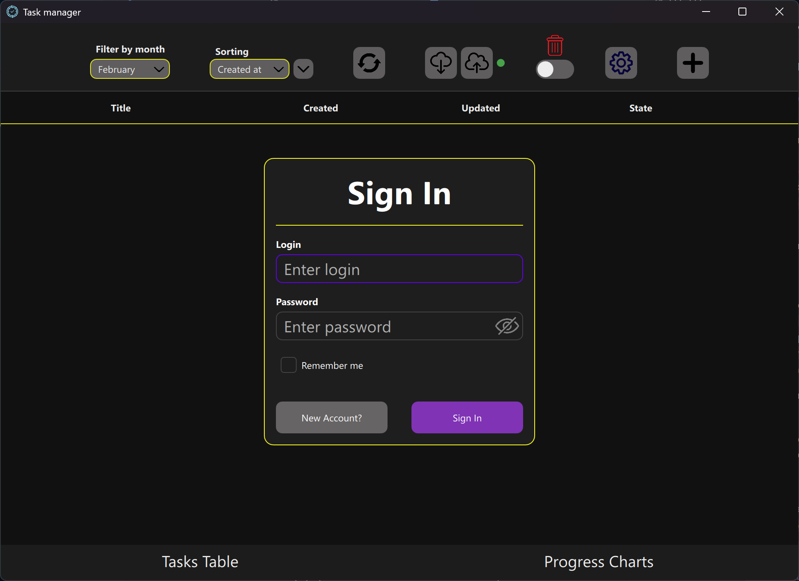
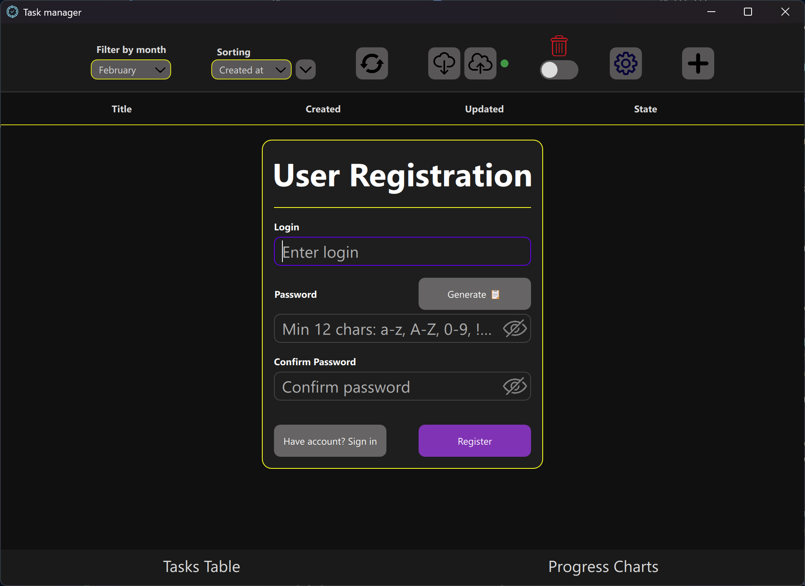

#### Task Management
Task list page with filtering options, priority levels, and due dates.
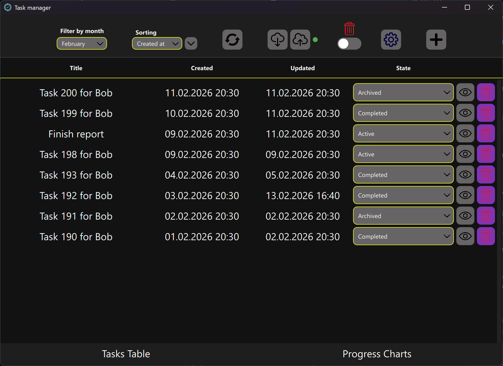

Create/edit dialog with required fields and validation.
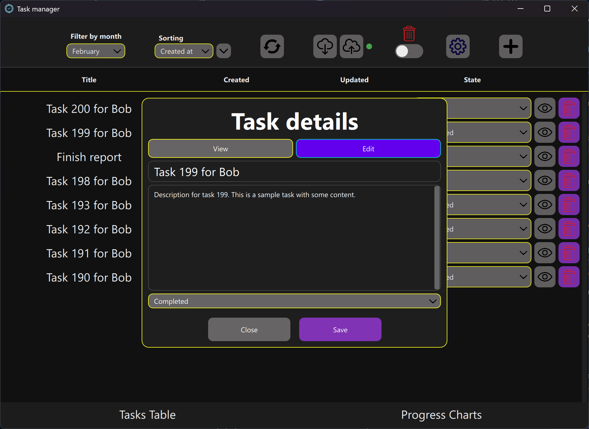

#### Data Visualization
OpenGL-based 2D and 3D bar charts for data analytics.
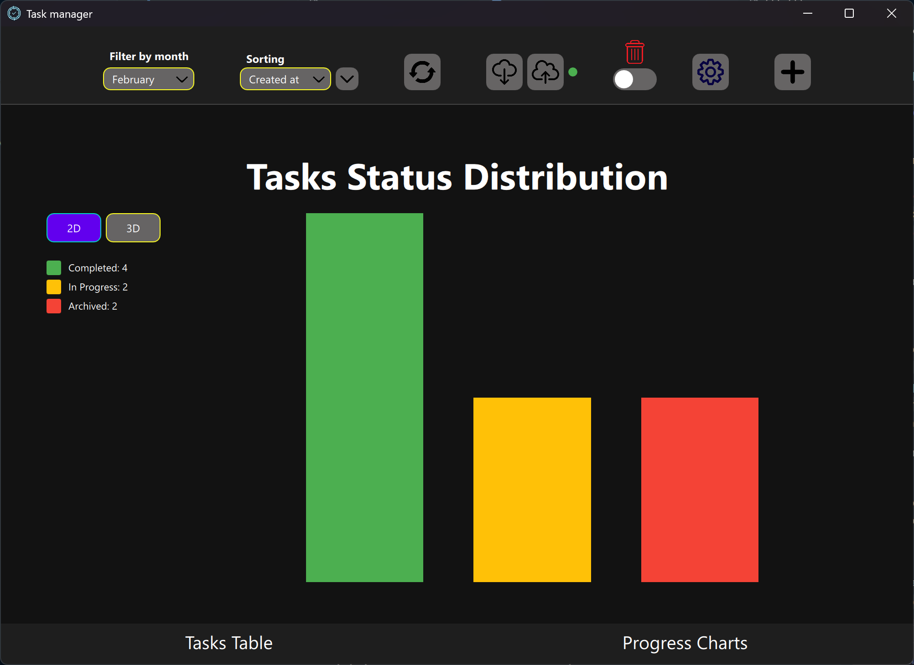
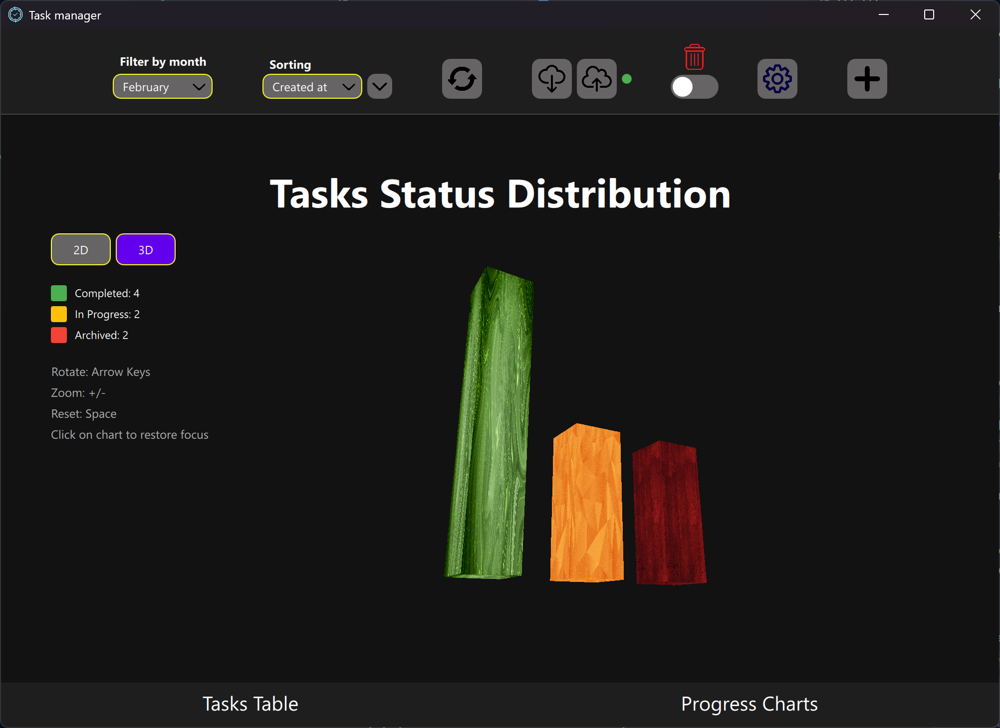

Server Integration
------------------
The app can connect to a server for authentication and data sync. The client uses a configurable base URL and JWT tokens:

- Base URL is set via `NetworkClient::setBaseUrl`.
- Access/refresh tokens are set via `NetworkClient::setAccessToken` and `NetworkClient::setRefreshToken`.

See the `TaskManagerServer` folder for the Python backend and its setup instructions.

Configuration Notes
-------------------
- The UI applies the saved theme at startup and supports remembered login.
- Auto-login uses a stored password hash (not the raw password).
- If you change server routes or ports, update the base URL accordingly.

Troubleshooting
---------------
- If the app shows empty lists, verify the database connection and/or server health.
- If network calls fail, check the server URL and token values.
- For OpenGL issues, ensure your GPU drivers are up to date.

License
-------
This project includes Argon2, which is distributed under its own license. See `argon2/LICENSE` for details.

---

TaskManager (Qt/QML) - Українською
=================================

Настільний менеджер завдань на Qt 6 та QML. Додаток забезпечує автентифікацію користувачів, керування завданнями, відгуки та необов'язкову синхронізацію з REST-сервером.

Огляд
-----
- Інтерфейс на Qt Quick (QML) з повторно використовуваними компонентами та діалогами.
- C++ моделі для користувачів, завдань і відгуків.
- Необов'язкова мережева синхронізація через `NetworkClient` з JWT токенами.
- OpenGL-діаграми для простої візуалізації даних.

Ключові можливості
------------------
- Вхід і реєстрація з можливістю запам'ятати користувача.
- CRUD завдань: створення, оновлення, видалення, список.
- CRUD відгуків: оцінка та опис.
- Локальна база даних і синхронізація з сервером (за потреби).
- Перемикач світлої/темної теми зі збереженням у налаштуваннях.

Технології
----------
- Qt 6 (Qt Quick, Qt Quick Controls 2, Qt SQL, Qt Network, OpenGL)
- C++11
- QML для UI
- Argon2 для хешування паролів (вбудовано в проєкт)

Структура проєкту
-----------------
- `main.cpp` та `main.qml`: точки входу.
- `src/` та `include/`: C++ моделі та допоміжні класи.
- `qml/`: компоненти, діалоги та сторінки.
- `network/`: REST клієнт і логіка синхронізації.
- `database/`: доступ до локальної бази.
- `assets/`: зображення та іконки.

Вимоги
------
- Qt 6.x з модулями: Quick, QuickControls2, SQL, Network, OpenGL
- C++ компілятор, підтримуваний Qt (наприклад, MinGW на Windows)
- Необов'язково: TaskManagerServer (у сусідній папці `TaskManagerServer`)

Збірка (Qt Creator)
-------------------
1. Відкрийте `TaskManager.pro` у Qt Creator.
2. Оберіть Qt 6 kit.
3. Налаштуйте та зберіть проєкт.
4. Запустіть додаток з Qt Creator.

Збірка (Командний рядок)
------------------------
У папці `TaskManager`:

```bash
qmake TaskManager.pro
make
```

На Windows з MinGW використовуйте `mingw32-make`, якщо `make` недоступний.

Release-розгортання (Windows)
-----------------------------
Після успішної Release-збірки розгорніть залежності Qt:

```powershell
cd TaskManager\release
.\TaskManager.exe
```

За ручного розгортання переконайтеся, що поруч із exe є папки:
- `platforms/`, `imageformats/`, `iconengines/`, `qml/`, `sqldrivers/`, `tls/`

Скріншоти
---------

#### Автентифікація
Екрани входу та реєстрації з полями вводу облікових даних та валідацією.

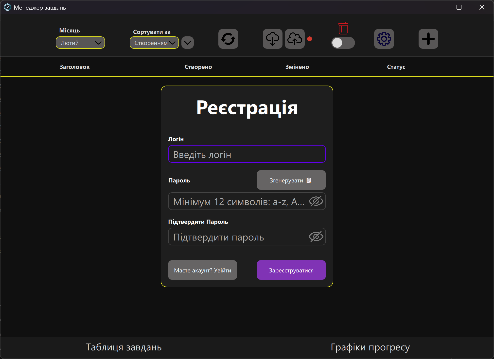

#### Керування завданнями
Сторінка списку завдань з параметрами фільтрації, рівнями пріоритету та термінами виконання.
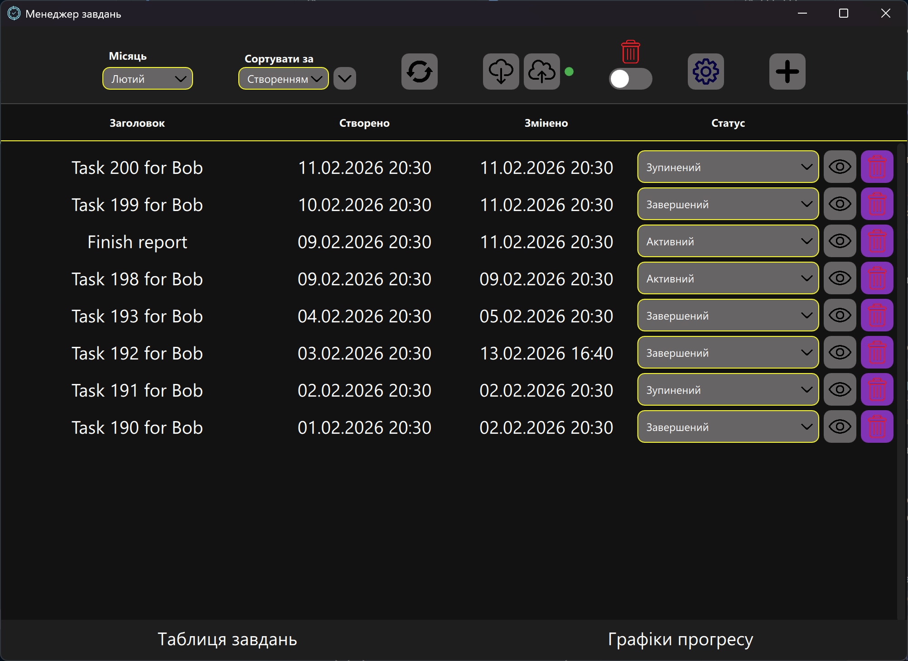

Діалог створення/редагування з обов'язковими полями та валідацією.
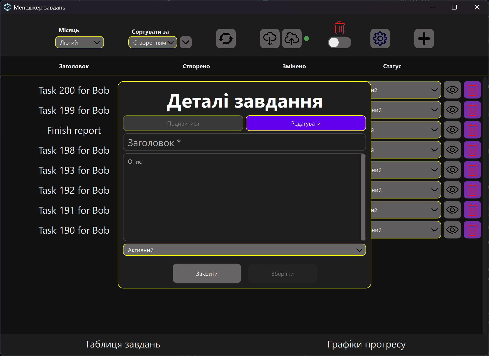

#### Візуалізація даних
OpenGL-діаграми 2D та 3D для посилення аналітики.
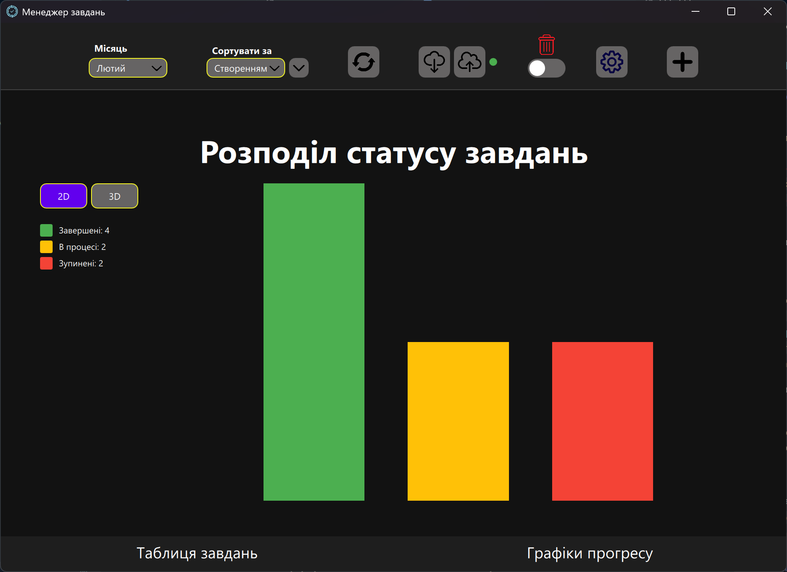
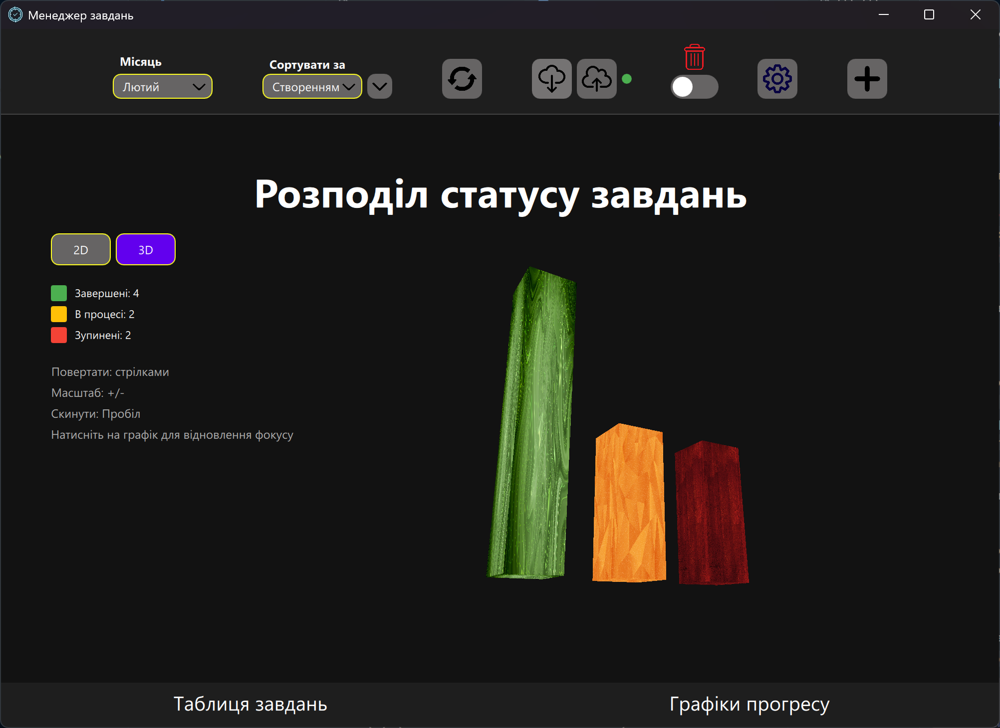

Інтеграція з сервером
---------------------
Клієнт може підключатися до сервера для автентифікації та синхронізації. Базовий URL і JWT токени налаштовуються так:

- Base URL задається через `NetworkClient::setBaseUrl`.
- Access/refresh токени задаються через `NetworkClient::setAccessToken` і `NetworkClient::setRefreshToken`.

Дивіться папку `TaskManagerServer` для інструкцій по серверу.

Нотатки щодо налаштувань
------------------------
- UI застосовує збережену тему при старті та підтримує запам'ятовування входу.
- Авто-вхід використовує збережений хеш пароля (не сирий пароль).
- При зміні маршрутів або портів оновіть base URL.

Усунення проблем
----------------
- Якщо списки порожні, перевірте підключення до БД та/або стан сервера.
- Якщо мережеві запити не працюють, перевірте URL та значення токенів.
- Для проблем з OpenGL оновіть драйвери GPU.

Ліцензія
--------
Проєкт включає Argon2, який розповсюджується за власною ліцензією. Див. `argon2/LICENSE`.
